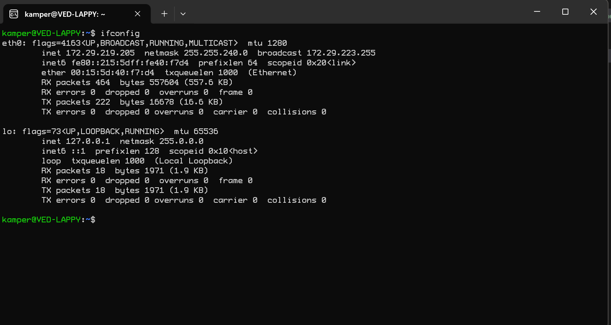
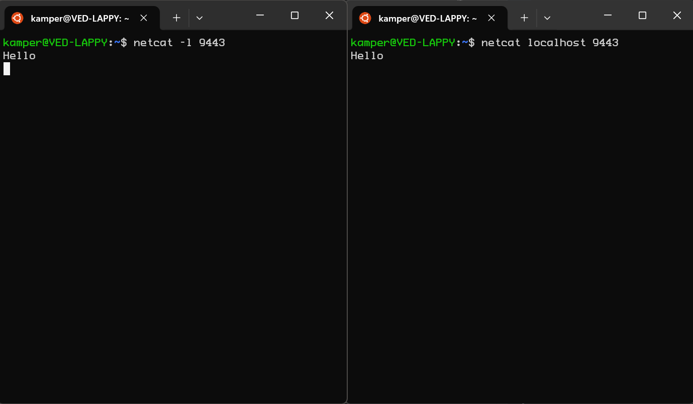
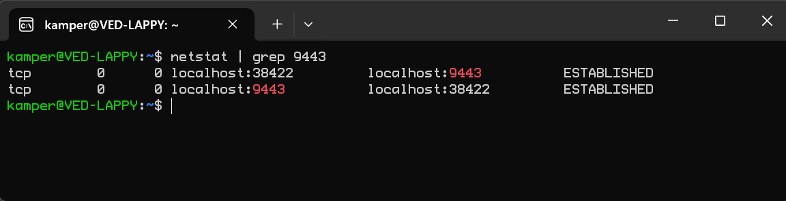
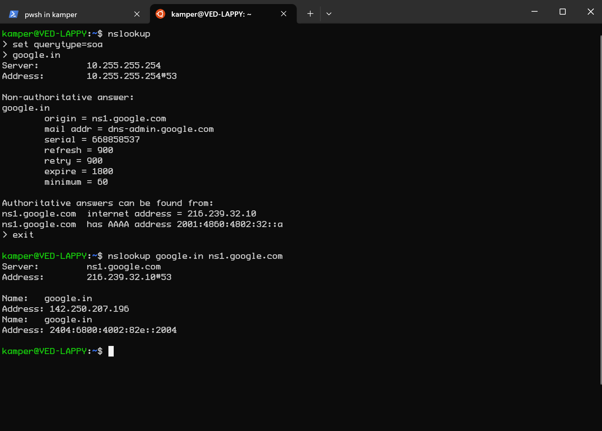
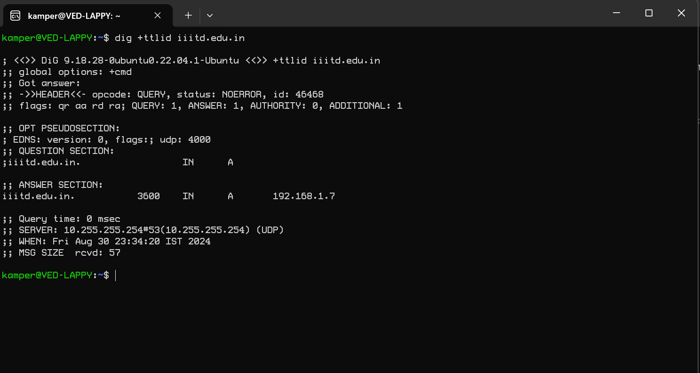
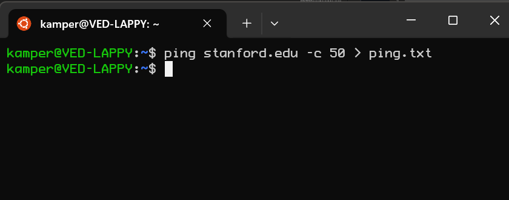

# Using command-line utilities for network debugging

## Question 1
a.  \
b. The IP address on the website https://whatismyip.com is different. This is because the IP addres shown in ifconfig is the private IP address provided by LAN and the IP address on the website is the public IP address that is used to identify the device on the internet.

## Question 2

you can revert back to the IP address by using the same command and use the original IP address. Alternatively, if you don't know the original IP address, you can reboot the system to revert to the original IP address.

## Question 3
a. 
b. 

## Question 4
a.  The query type soa shows where the authorative answers can be found from.\
b.  This entry would expire from the local DNS server in 184 seconds which means the cache for this will be cleared from the server every 184 seconds.

## Question 5
a.  \
average latency \
1 0.264ms \
2 1.489ms \
3 0.390ms \
4 0.634ms \
5 NA \
6 5.466ms \
7 4.132ms \
8 27.115ms \
9 30.218ms \
10 29.751ms \
\
b.

```
PING google.in (142.250.193.4) 56(84) bytes of data.
64 bytes from del11s14-in-f4.1e100.net (142.250.193.4): icmp_seq=1 ttl=54 time=30.1 ms
64 bytes from del11s14-in-f4.1e100.net (142.250.193.4): icmp_seq=2 ttl=54 time=30.1 ms
64 bytes from del11s14-in-f4.1e100.net (142.250.193.4): icmp_seq=3 ttl=54 time=30.0 ms
64 bytes from del11s14-in-f4.1e100.net (142.250.193.4): icmp_seq=4 ttl=54 time=30.8 ms
64 bytes from del11s14-in-f4.1e100.net (142.250.193.4): icmp_seq=5 ttl=54 time=30.2 ms
64 bytes from del11s14-in-f4.1e100.net (142.250.193.4): icmp_seq=6 ttl=54 time=30.1 ms
64 bytes from del11s14-in-f4.1e100.net (142.250.193.4): icmp_seq=7 ttl=54 time=30.3 ms
64 bytes from del11s14-in-f4.1e100.net (142.250.193.4): icmp_seq=8 ttl=54 time=30.2 ms
64 bytes from del11s14-in-f4.1e100.net (142.250.193.4): icmp_seq=9 ttl=54 time=30.3 ms
64 bytes from del11s14-in-f4.1e100.net (142.250.193.4): icmp_seq=10 ttl=54 time=30.2 ms
64 bytes from del11s14-in-f4.1e100.net (142.250.193.4): icmp_seq=11 ttl=54 time=30.6 ms
64 bytes from del11s14-in-f4.1e100.net (142.250.193.4): icmp_seq=12 ttl=54 time=30.1 ms
64 bytes from del11s14-in-f4.1e100.net (142.250.193.4): icmp_seq=13 ttl=54 time=30.2 ms
64 bytes from del11s14-in-f4.1e100.net (142.250.193.4): icmp_seq=14 ttl=54 time=30.6 ms
64 bytes from del11s14-in-f4.1e100.net (142.250.193.4): icmp_seq=15 ttl=54 time=30.6 ms
64 bytes from del11s14-in-f4.1e100.net (142.250.193.4): icmp_seq=16 ttl=54 time=30.2 ms
64 bytes from del11s14-in-f4.1e100.net (142.250.193.4): icmp_seq=17 ttl=54 time=30.1 ms
64 bytes from del11s14-in-f4.1e100.net (142.250.193.4): icmp_seq=18 ttl=54 time=30.4 ms
64 bytes from del11s14-in-f4.1e100.net (142.250.193.4): icmp_seq=19 ttl=54 time=30.8 ms
64 bytes from del11s14-in-f4.1e100.net (142.250.193.4): icmp_seq=20 ttl=54 time=30.2 ms
64 bytes from del11s14-in-f4.1e100.net (142.250.193.4): icmp_seq=21 ttl=54 time=30.0 ms
64 bytes from del11s14-in-f4.1e100.net (142.250.193.4): icmp_seq=22 ttl=54 time=30.2 ms
64 bytes from del11s14-in-f4.1e100.net (142.250.193.4): icmp_seq=23 ttl=54 time=30.6 ms
64 bytes from del11s14-in-f4.1e100.net (142.250.193.4): icmp_seq=24 ttl=54 time=30.1 ms
64 bytes from del11s14-in-f4.1e100.net (142.250.193.4): icmp_seq=25 ttl=54 time=30.4 ms
64 bytes from del11s14-in-f4.1e100.net (142.250.193.4): icmp_seq=26 ttl=54 time=31.2 ms
64 bytes from del11s14-in-f4.1e100.net (142.250.193.4): icmp_seq=27 ttl=54 time=30.7 ms
64 bytes from del11s14-in-f4.1e100.net (142.250.193.4): icmp_seq=28 ttl=54 time=30.2 ms
64 bytes from del11s14-in-f4.1e100.net (142.250.193.4): icmp_seq=29 ttl=54 time=30.2 ms
64 bytes from del11s14-in-f4.1e100.net (142.250.193.4): icmp_seq=30 ttl=54 time=30.3 ms
64 bytes from del11s14-in-f4.1e100.net (142.250.193.4): icmp_seq=31 ttl=54 time=30.1 ms
64 bytes from del11s14-in-f4.1e100.net (142.250.193.4): icmp_seq=32 ttl=54 time=30.2 ms
64 bytes from del11s14-in-f4.1e100.net (142.250.193.4): icmp_seq=33 ttl=54 time=31.3 ms
64 bytes from del11s14-in-f4.1e100.net (142.250.193.4): icmp_seq=34 ttl=54 time=30.3 ms
64 bytes from del11s14-in-f4.1e100.net (142.250.193.4): icmp_seq=35 ttl=54 time=30.4 ms
64 bytes from del11s14-in-f4.1e100.net (142.250.193.4): icmp_seq=36 ttl=54 time=30.0 ms
64 bytes from del11s14-in-f4.1e100.net (142.250.193.4): icmp_seq=37 ttl=54 time=30.2 ms
64 bytes from del11s14-in-f4.1e100.net (142.250.193.4): icmp_seq=38 ttl=54 time=30.3 ms
64 bytes from del11s14-in-f4.1e100.net (142.250.193.4): icmp_seq=39 ttl=54 time=30.2 ms
64 bytes from del11s14-in-f4.1e100.net (142.250.193.4): icmp_seq=40 ttl=54 time=30.2 ms
64 bytes from del11s14-in-f4.1e100.net (142.250.193.4): icmp_seq=41 ttl=54 time=30.2 ms
64 bytes from del11s14-in-f4.1e100.net (142.250.193.4): icmp_seq=42 ttl=54 time=30.1 ms
64 bytes from del11s14-in-f4.1e100.net (142.250.193.4): icmp_seq=43 ttl=54 time=31.2 ms
64 bytes from del11s14-in-f4.1e100.net (142.250.193.4): icmp_seq=44 ttl=54 time=31.2 ms
64 bytes from del11s14-in-f4.1e100.net (142.250.193.4): icmp_seq=45 ttl=54 time=30.2 ms
64 bytes from del11s14-in-f4.1e100.net (142.250.193.4): icmp_seq=46 ttl=54 time=30.1 ms
64 bytes from del11s14-in-f4.1e100.net (142.250.193.4): icmp_seq=47 ttl=54 time=30.0 ms
64 bytes from del11s14-in-f4.1e100.net (142.250.193.4): icmp_seq=48 ttl=54 time=30.4 ms
64 bytes from del11s14-in-f4.1e100.net (142.250.193.4): icmp_seq=49 ttl=54 time=30.3 ms
64 bytes from del11s14-in-f4.1e100.net (142.250.193.4): icmp_seq=50 ttl=54 time=30.1 ms

--- google.in ping statistics ---
50 packets transmitted, 50 received, 0% packet loss, time 49089ms
rtt min/avg/max/mdev = 30.003/30.338/31.261/0.327 ms
```
the average ping is 30.338ms. (NOTE: I decided to take text output because screenshot wouldn't fit the entire contents) \
\
c. The total traceroute latency is 99.459ms which doesn't much the latency of 30.338ms from ping. Traceroute sends packets to each node and waits for the timeout response on each node. The traceroute shows the time it takes for each of those nodes to respond. \
\
d. The maximum latency in (a) is very close to the average ping latency in (b). This is because the latency to get to the final destination should be the same. \
\
e. There are more than one entries in intermediate hosts because there is more than one path from the machine to the final destination. \
\
f.  
```
PING stanford.edu (171.67.215.200) 56(84) bytes of data.
64 bytes from web.stanford.edu (171.67.215.200): icmp_seq=1 ttl=235 time=271 ms
64 bytes from web.stanford.edu (171.67.215.200): icmp_seq=2 ttl=235 time=271 ms
64 bytes from web.stanford.edu (171.67.215.200): icmp_seq=3 ttl=235 time=271 ms
64 bytes from web.stanford.edu (171.67.215.200): icmp_seq=4 ttl=235 time=271 ms
64 bytes from web.stanford.edu (171.67.215.200): icmp_seq=5 ttl=235 time=271 ms
64 bytes from web.stanford.edu (171.67.215.200): icmp_seq=6 ttl=235 time=271 ms
64 bytes from web.stanford.edu (171.67.215.200): icmp_seq=7 ttl=235 time=271 ms
64 bytes from web.stanford.edu (171.67.215.200): icmp_seq=8 ttl=235 time=271 ms
64 bytes from web.stanford.edu (171.67.215.200): icmp_seq=9 ttl=235 time=271 ms
64 bytes from web.stanford.edu (171.67.215.200): icmp_seq=10 ttl=235 time=270 ms
64 bytes from web.stanford.edu (171.67.215.200): icmp_seq=11 ttl=235 time=271 ms
64 bytes from web.stanford.edu (171.67.215.200): icmp_seq=12 ttl=235 time=271 ms
64 bytes from web.stanford.edu (171.67.215.200): icmp_seq=13 ttl=235 time=271 ms
64 bytes from web.stanford.edu (171.67.215.200): icmp_seq=14 ttl=235 time=272 ms
64 bytes from web.stanford.edu (171.67.215.200): icmp_seq=15 ttl=235 time=271 ms
64 bytes from web.stanford.edu (171.67.215.200): icmp_seq=16 ttl=235 time=271 ms
64 bytes from web.stanford.edu (171.67.215.200): icmp_seq=17 ttl=235 time=271 ms
64 bytes from web.stanford.edu (171.67.215.200): icmp_seq=18 ttl=235 time=271 ms
64 bytes from web.stanford.edu (171.67.215.200): icmp_seq=19 ttl=235 time=271 ms
64 bytes from web.stanford.edu (171.67.215.200): icmp_seq=20 ttl=235 time=271 ms
64 bytes from web.stanford.edu (171.67.215.200): icmp_seq=21 ttl=235 time=271 ms
64 bytes from web.stanford.edu (171.67.215.200): icmp_seq=22 ttl=235 time=271 ms
64 bytes from web.stanford.edu (171.67.215.200): icmp_seq=23 ttl=235 time=274 ms
64 bytes from web.stanford.edu (171.67.215.200): icmp_seq=24 ttl=235 time=271 ms
64 bytes from web.stanford.edu (171.67.215.200): icmp_seq=25 ttl=235 time=271 ms
64 bytes from web.stanford.edu (171.67.215.200): icmp_seq=26 ttl=235 time=271 ms
64 bytes from web.stanford.edu (171.67.215.200): icmp_seq=27 ttl=235 time=271 ms
64 bytes from web.stanford.edu (171.67.215.200): icmp_seq=28 ttl=235 time=271 ms
64 bytes from web.stanford.edu (171.67.215.200): icmp_seq=29 ttl=235 time=271 ms
64 bytes from web.stanford.edu (171.67.215.200): icmp_seq=30 ttl=235 time=271 ms
64 bytes from web.stanford.edu (171.67.215.200): icmp_seq=31 ttl=235 time=271 ms
64 bytes from web.stanford.edu (171.67.215.200): icmp_seq=32 ttl=235 time=271 ms
64 bytes from web.stanford.edu (171.67.215.200): icmp_seq=33 ttl=235 time=271 ms
64 bytes from web.stanford.edu (171.67.215.200): icmp_seq=34 ttl=235 time=271 ms
64 bytes from web.stanford.edu (171.67.215.200): icmp_seq=35 ttl=235 time=271 ms
64 bytes from web.stanford.edu (171.67.215.200): icmp_seq=36 ttl=235 time=271 ms
64 bytes from web.stanford.edu (171.67.215.200): icmp_seq=37 ttl=235 time=271 ms
64 bytes from web.stanford.edu (171.67.215.200): icmp_seq=38 ttl=235 time=271 ms
64 bytes from web.stanford.edu (171.67.215.200): icmp_seq=39 ttl=235 time=271 ms
64 bytes from web.stanford.edu (171.67.215.200): icmp_seq=40 ttl=235 time=271 ms
64 bytes from web.stanford.edu (171.67.215.200): icmp_seq=41 ttl=235 time=271 ms
64 bytes from web.stanford.edu (171.67.215.200): icmp_seq=42 ttl=235 time=271 ms
64 bytes from web.stanford.edu (171.67.215.200): icmp_seq=43 ttl=235 time=271 ms
64 bytes from web.stanford.edu (171.67.215.200): icmp_seq=44 ttl=235 time=271 ms
64 bytes from web.stanford.edu (171.67.215.200): icmp_seq=45 ttl=235 time=271 ms
64 bytes from web.stanford.edu (171.67.215.200): icmp_seq=46 ttl=235 time=271 ms
64 bytes from web.stanford.edu (171.67.215.200): icmp_seq=47 ttl=235 time=271 ms
64 bytes from web.stanford.edu (171.67.215.200): icmp_seq=48 ttl=235 time=271 ms
64 bytes from web.stanford.edu (171.67.215.200): icmp_seq=49 ttl=235 time=271 ms
64 bytes from web.stanford.edu (171.67.215.200): icmp_seq=50 ttl=235 time=271 ms

--- stanford.edu ping statistics ---
50 packets transmitted, 50 received, 0% packet loss, time 49063ms
rtt min/avg/max/mdev = 270.380/270.999/274.375/0.556 ms
```
The average latency for stanford.edu is 270.999ms \
\
g.  there are 26 intermeidate hosts in stanford.edu compared to 10 intermediate hosts in google.in \
\
h. The main reason for higher latency in stanford.edu compared to google.in is due to the distance of the machines being different. stanford.edu probably has its node in america while google.in is probably in India. Latency of communication increases as distance increases.

## Question 6

Just remove the loopback and you can have 100% packet loss.